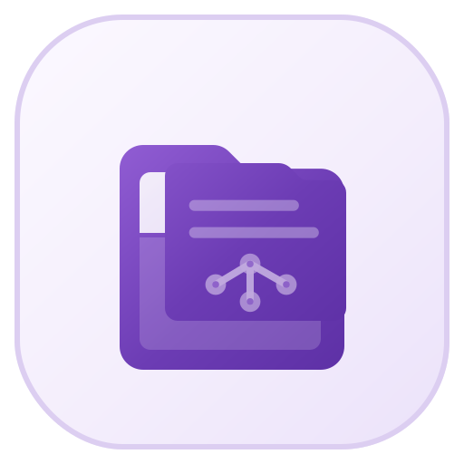
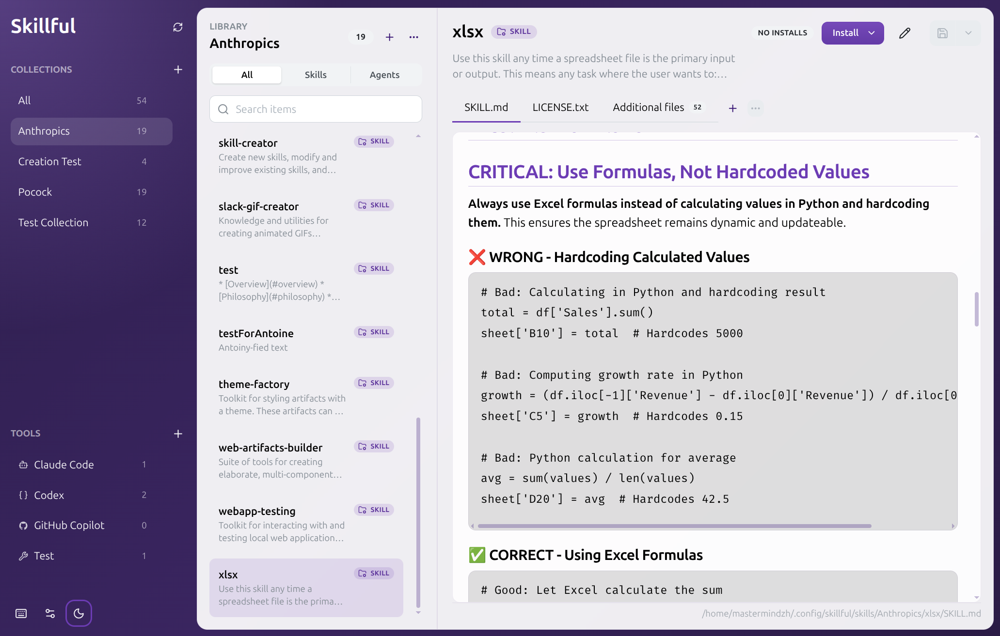
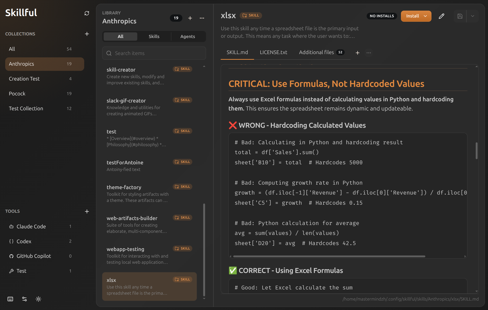

# Skillful

  

  <strong>Build reusable AI workflows from files you own.</strong> 
  Edit skills and agents as real folders, keep supporting files beside them, and install into your AI tools without duplicating your source library.

  <a href="https://skillful.md"><strong>Website</strong></a> ·
  <a href="https://github.com/Mastermindzh/skillful/releases/latest"><strong>Download</strong></a> ·
  <a href="docs/install.md"><strong>Install guide</strong></a> ·
  <a href="docs/import-buttons.md"><strong>Import buttons</strong></a>

  
  
  
  

---

Skillful is a cross-platform desktop app for people building reusable AI workflows on disk.

A skill is a folder with `SKILL.md`. An agent is a folder with `AGENT.md`. Skillful gives those folders a proper workspace: searchable collections, markdown editing and preview, additional files, imports, exports, validation, and one-click installs into tools like Claude Code, Codex, Cursor, GitHub Copilot, Gemini CLI, Junie, and opencode.

No account. No cloud storage. No proprietary database. Your library stays on disk.

## Why It Exists

AI workflows are becoming real working assets, but most people still manage them like scattered notes:

- one copy in Claude Code
- another copy in Codex
- a half-updated version in an Obsidian vault
- screenshots and scripts somewhere else entirely
- no clear way to tell what is installed where

Skillful treats those files like a library worth maintaining. Edit once, install where needed, repair broken installs, and keep the source of truth readable even without the app.

## Highlights

- Manage folder-based skills and agents
- Create, rename, delete, move, import, and export collections
- Edit and preview markdown files
- Keep screenshots, scripts, examples, and other supporting files beside each item
- Install the same item into multiple tools without copying source files
- Detect and repair broken installs
- Import folders, `.skillful.zip` archives, and public GitHub source archives
- Open Skillful import links from repositories that publish GitHub-safe import buttons
- Validate frontmatter metadata and warn before incomplete entries drift into your library
- Search and filter large local libraries by collection, tool, and item kind
- Works offline, with the filesystem as the source of truth

## Screenshots

## Downloads

Download the latest release from GitHub:

- [Latest release](https://github.com/Mastermindzh/skillful/releases/latest)

Current release artifacts include Windows, macOS, and Linux builds. Linux artifacts include AppImage, `.deb`, `.rpm`, pacman, Snap, and Flatpak bundles.

For platform notes, see [docs/install.md](docs/install.md).

### A note on unsigned builds

Skillful is a free, source-available side project. Apple and Windows code-signing
certificates cost real money every year, and that cost isn't justified yet for
a project at this stage. (though feel free to donate...) So the macOS DMG and the Windows installer ship
**unsigned**, and you'll see a one-time OS warning the first time you run them, additionally, auto-update might also be denied by your OS:

- **macOS**: "Skillful is damaged and can't be opened" or "cannot be opened
  because the developer cannot be verified". Get past it once with
  `xattr -dr com.apple.quarantine /Applications/Skillful.app`, or
  System Settings → Privacy & Security → "Open Anyway" after the first failed
  launch.
- **Windows**: SmartScreen "Unrecognized app" prompt. Click *More info* →
  *Run anyway*. It won't ask again on subsequent launches.
- **Linux**: no signing prompts; the package format you choose handles
  integrity (HTTPS download + SHA-512 in `latest-linux.yml`, repo signatures,
  or store review).

Because the entire source, lockfiles, and CI build pipeline are public, you
don't have to take my word that the binaries are clean, you can verify it
yourself however you like:

- read the source (this repo); the bundled app is exactly what's in
  `src/electron/`, `src/main/`, `src/mainview/`, and `src/shared/`
- read the GitHub Actions release log for any tag to see the exact commands
  that produced the artifacts
- rebuild from a tag locally with `bun install --frozen-lockfile && bun run dist`
  and compare against the published `latest-*.yml` SHA-512 hashes
- watch network traffic; the only outbound calls are GitHub release checks
  and the GitHub source archives you explicitly import

If a sponsor or sustained user growth ever justifies the certificate cost,
signing will happen and these warnings will go away. Until then, this is the
honest tradeoff.

## Import Buttons

Skill libraries can add README buttons that open Skillful with the import dialog prefilled.

Examples:

- 
- 
- 
- 

Create your own button with the [Skillful import button generator](https://skillful.md/generator/), or read [docs/import-buttons.md](docs/import-buttons.md).

## Documentation

- [Install guide](docs/install.md)
- [Keyboard shortcuts](docs/shortcuts.md)
- [Import buttons](docs/import-buttons.md)
- [Changelog](CHANGELOG.md)
- [Development](docs/development.md)
- [Release checklist](docs/release-checklist.md)
- [Translation guide](docs/translations.md)

## Contributing

Issues and pull requests are welcome.

Translations are especially welcome. Skillful uses a lightweight typed `react-i18next` setup; see [docs/translations.md](docs/translations.md) to add or improve a language.

When changing core workflow behavior, keep the product model intact:

- the filesystem stays the source of truth
- collections are content groups
- tools are install destinations
- skills and agents stay as readable folders on disk
- user-facing behavior should get tests

## License

Functional Source License 1.1 with an MIT future license. See [LICENSE](LICENSE).
